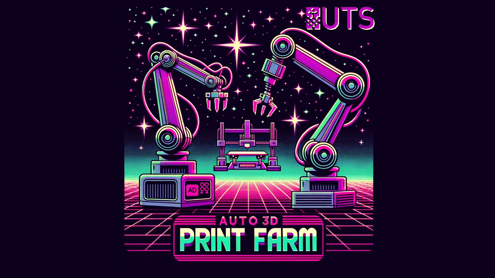
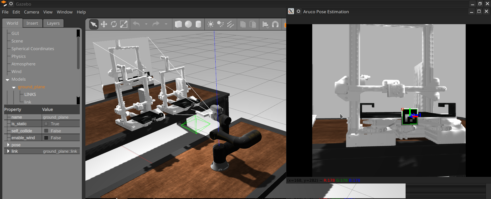
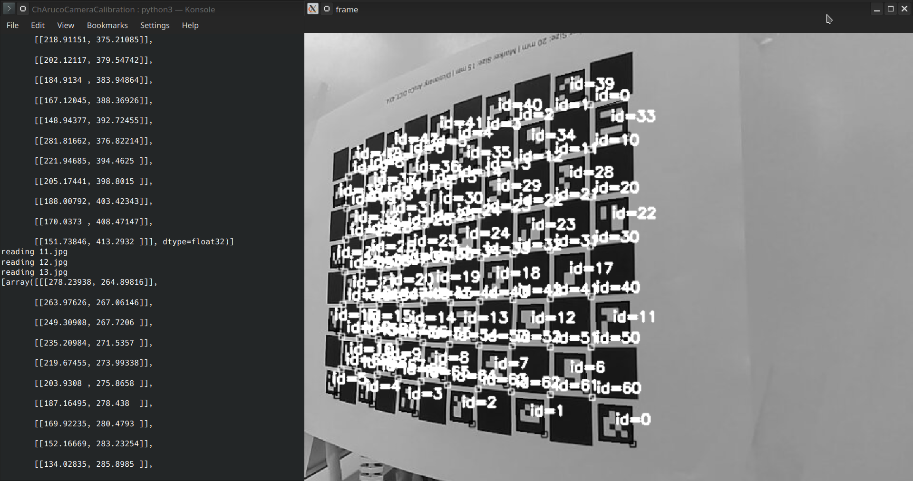

#  UTS Auto 3D Print Farm Project (Sensors and Control + Industrial Robotics Project) Spring 2023



https://github.com/Aheadz/UTS-IR-SnC-Project-Spring2023/

The github repo is for the combined Industrial Robotics and Sensors & Control Group Projects
Group Members in Industrial Robotics are:
- Alexander Dickson, 
- Zahead Rashidi,
- Mostafa Rahimi.

Group Members in Sensors & Control are:

- Alexander Dickson,
- Zahead Rashidi,
- Selimon Shukurzad

# Sensors & Control Submission

Our submission consists of three parts:

- A customized package for the OMRON TM5 which has been derived from the main Techman Robotics Repository for the OMRON robots (https://github.com/TechmanRobotInc/tmr_ros1). This package includes the simulator setup, ARuco Pose Estimation Script and Visual Servoing Script.
- Code for the UR3e with an attached RGB-D sensor. This is the code that was used for doing the object detection and classification. There is no simulator for testing this code as all testing was done on the real robot.
- A Python Script for doing automatic ChARuco Camera Calibration used to find the intrinsic parameters of our USB Camera. This Script was modified from https://github.com/nullboundary/CharucoCalibration to work in Python 3 and a more recent version of OpenCV.

Our contribution to the code was distributed evenly (33% per student)


## Prerequisites

- ROS Noetic
- Ubuntu 20.04
- Python 3.8.10
- Laptop with GPU

## TM5 Visual Servoing (Zahead Rashidi)

Follow the steps below to install the tm5_custom package:

1. **Install ROS Executable Dependencies:**
    ```bash
    sudo apt install ros-noetic-industrial-robot-simulator ros-noetic-controller-manager ros-noetic-actionlib ros-noetic-moveit ros-noetic-usb-cam
    ```
2. **Setup a ROS Workspace:**
    ```bash
    mkdir -p ~/tm_ws/src
    cd ~/tm_ws/
    catkin_make
    source devel/setup.bash
    ```
3. **Clone the Repository & Add Package to Workspace:**
    ```bash
    cd ~
    git clone https://github.com/Aheadz/UTS-IR-SnC-Project-Spring2023.git
    mv ~/UTS-IR-SnC-Project-Spring2023/Sensors_n_Control/tm5_custom ~/tm_ws/src/tm5_custom
    ```

4. **Install Dependencies (if any):**
    ```bash
    cd ~/tm_ws
    rosdep install --from-paths src --ignore-src -r -y
    ```

5. **Build the Package:**
    ```bash
    cd ~/tm_ws
    catkin_make
    ```

6. **Source the Workspace:**
    ```bash
    source devel/setup.bash
    ```
7. **Install Python Dependencies:**
    ```bash
    cd ~/UTS-IR-SnC-Project-Spring2023/Sensors_n_Control
    python3.8 -m venv venv
    source venv/bin/activate
    pip install -r requirements.txt
    ```
## Usage
1. **Launch The Simulator:**
    ```bash
     roslaunch tm5_custom tm5-700_gazebo.launch
    ```
2. **Launch The Moveit! Config:**
    Launch a new terminal window and go to workspace:
    ```bash
    cd ~/tm_ws
    source devel/setup.bash
    ```
    Now launch moveit planning framework:
    ```bash
     roslaunch tm5_custom tm5-700_moveit_planning_execution_gazebo.launch
    ```
3. **Launch The ARuco Pose Estimation Script:**
    Launch a new terminal window and go to workspace:
    ```bash
    cd ~/tm_ws
    source devel/setup.bash
    ```
    Launch the Aruco Pose Estimation Script:
    ```bash
    rosrun tm5_custom arucoPoseEstimation2.py
    ```
    This should open up a window with the simulated camera feed, The image topic may not be /image_raw in your environment so change if necessary.
4. **Launch Visual Servoing Script:**
    Launch a new terminal window and go to workspace:
    ```bash
    cd ~/tm_ws
    source devel/setup.bash
    ```
    Run the visual servoing script and enjoy!
    ```bash
    rosrun tm5_custom attachTool.py
    ```
The Script should begin moving the robot towards a printer based on the ARuco tag Position. The tag detection should also be visible such as here:


## UR3e Object Detection & Classification (Selimon Shukurzad)

The files in the folder "UR3e_Software" contain the main code that was used to perform the object detection and classification along with grasping and sorting functions. The contents of the folder and the purpose of each file is described as follows:

**depth_image_processing:**
- image_to_xyz.cpp: transforms images such that every pixel in the image has a relative position (x,y,z).
- rgb_image_within_range.cpp: limits the output from the RGB-D sensor such that pixels far away are clipped, so that viewing the top surface of components are easier to detect.

**UR3e_Sensors_n_Control:**
- UR3e .py Class responsible for controlling the robot with the UR3e
- RG2 .py Class responsible for controlling the gripper.
- s_n_c.py: runs all the movements of the robot
- detecting_circle_or_square_function.py: returns a list to indicate the shape of the object, the centrepoint, the angle, and the radius.
## ChAruco Camera Calibration (Alexander Dickson)

1. Ensure that you have cloned the repo as per step 3 in the tm5 package install instructions above.
2. Ensure you have installed the correct python package versions as per step 7 above.
3. **Navigate to the folder:**
    ```bash
    cd ~/UTS-IR-SnC-Project-Spring2023/Sensors_n_Control/ChArucoCameraCalibration/
    ```
4. **Run the Python Script:**
   ```bash
   python3 arucoBoard.py  -f calibrated.yml 10.jpg  11.jpg  12.jpg  13.jpg  14.jpg  15.jpg  16.jpg  17.jpg  18.jpg  19.jpg  1.jpg  20.jpg  21.jpg  22.jpg  23.jpg  24.jpg  2.jpg  3.jpg  4.jpg  5.jpg  6.jpg  7.jpg  8.jpg  9.jpg
   ```
5. Hit Space on each Photograph to progess throught the calibration image set, at the end the intrinsic paramters of the camera are output.

The output should look something like this:

